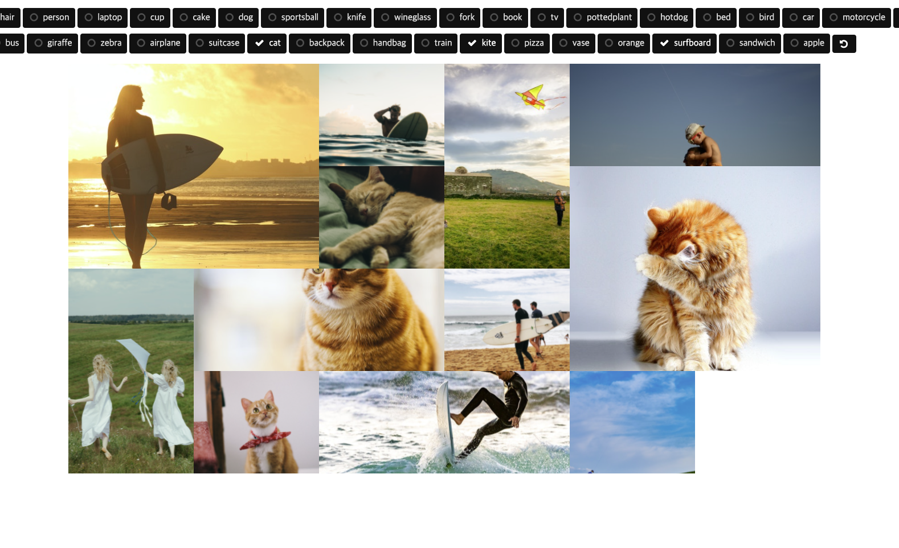

# YOLO Photo Album

Create photo gallery using YOLOv5 object detection.

- Beautiful gallery view
- Auto categorizing and filtering by multiple tags



## Run

```
main.ipynb
```

and connect to http://127.0.0.1:5000/ using web browser.

## Dependency

- Python 3
- torch==1.9.0
- torchvision==0.10.0
- Flask

## Reference

- YOLOv5 https://github.com/ultralytics/yolov5
- nanogallery2 https://github.com/nanostudio-org/nanogallery2
